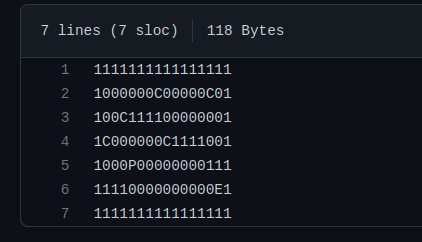

# so_long 👾

  

    
So_Long is a simple 2D game. As a player, you have to collect all the items on the map before going through the stairs. To move, you can use either W, A, S, D or the arrow keys. It will exit the game window both when ESC is pressed or the cross button is clicked. The map generated for the game must be a file with '.ber' as an extension. It will contain characters to serve as a 'frame' for the place. The system is:  
 - '0' for empty spaces  
 - '1' for walls  
 - 'P' for the player  
 - 'C' for the collectibles  
 - 'E' for the exit  
   
As an example, below is the file that generated the map for the image above:  

  

 
The rules are simple:  
  - The character must collect all items before leaving the map  
  - The map must have different values for width and height  
  - It must be surrounded by walls  
  - It must contain at least one collectable and one exit  
  - No more than one player, of course  
  
## Installation  
**Clone this repo**  
> git clone [repo url] [directory name]  
  
**Enter the directory you created**  
> cd [directory name]  
  
**'Make' to generate the executable**  
> make  
  
**Run the program including the name of the map file** (or the path, if it's in a directory of its own)    
> ./so_long ./maps/map01.ber

## 🛠 The MiniLibx (or: *getting to know the graphic library*)  

In summary, this library provides functions to open and manage windows, draw pixels, insert and destroy images and, of course, keep your program on a loop. Below, some useful links to practice and understand the MiniLibX better:  
  
✨ [Tutorial with examples](https://gontjarow.github.io/MiniLibX/)  
✨ [Some awesome explaining about MLX Images](https://github.com/keuhdall/images_example)  

